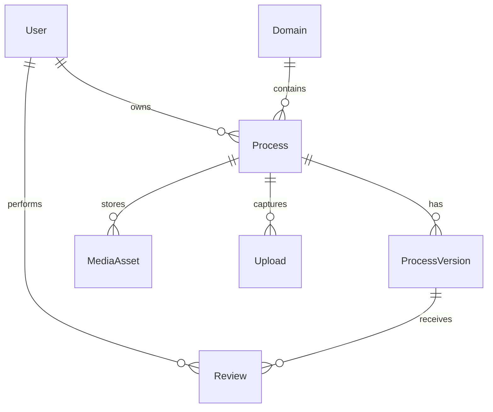

# BPMN AI Process Modeler – Architekturüberblick

## Zielsetzung
Die Anwendung unterstützt Mitarbeitende dabei, Prozesse per Sprache oder Text zu erfassen. Die Inhalte werden transkribiert, strukturiert und als BPMN 2.0 Modelle inklusive SOP-Dokumentation bereitgestellt.

## Gesamtübersicht
- **Frontend:** Vue 3 + Pinia + Vite. Enthält Recorder, BPMN-Editor (bpmn.js) und Prozessbuch.
- **Backend:** Laravel 11 (PHP 8.2). API-first Ansatz mit Sanctum für Authentifizierung.
- **Dienste:** OpenAI (Transkription & LLM), DB-Queues, Storage für Audio & Exporte.

## Modulaufteilung
### Upload & Medienverwaltung
- `UploadService` verwaltet chunked Uploads (≤ 15 MB) für Ogg/WebM.
- `Upload*Controller` orchestrieren Initiierung, Chunk-Handling und Finalisierung.
- Fertige Uploads können als MediaAsset einem Prozess zugeordnet werden.

### Transkription & Stitching
- `TranscriptionService` führt pro Chunk einen API-Call zur OpenAI Transkription aus.
- `TextStitchingService` dedupliziert überlappende Segmente (2–3 Sekunden Heuristik).

### Extraktion & BPMN Generierung
- `ExtractionService` erstellt strukturierte JSON-Antworten (strict schema) aus Transkripten.
- `BpmnGenerationService` überführt das JSON in BPMN 2.0 XML.
- Frontend zeigt XML im bpmn.js Modeler (Auto-Layout via bpmn.js).

### Prozesse & Versionierung
- Modelle: `Process`, `ProcessVersion`, `Review`, `MediaAsset` etc.
- `ProcessVersionController` kapselt Draft, Autosave und Publish inklusive L4-Prüfung.
- Reviews (`ProcessReviewController`) erlauben approve/request_changes Entscheidungen.

### Suche, Export, Prozessbuch
- `SearchService` indexiert Titel, Summary und Labels (JSON) für Volltextsuche.
- `ProcessBookService` generiert Beschreibungen (OpenAI) und Exporte (BPMN, PDF, ZIP).

### Sicherheit & Governance
- Spatie Permission bildet Rollen (Reader, Author, Reviewer, Owner, Admin) ab.
- `ProcessPolicy` implementiert Zugriffskontrollen je Status.
- Audit-Log via spatie/activitylog (konfigurationsbereit).

### Betrieb
- DB Queue (`queue:work` oder Scheduler) für asynchrone Jobs.
- Health Checks und Backups über geplante Commands erweiterbar.

## Datenmodell (vereinfacht)

## Frontend Routen
- `/capture` – Aufnahme & Textnotizen.
- `/processes` – Prozessliste & Erstellung.
- `/processes/:id/edit` – BPMN-Editor mit L4-SOP Panels.
- `/review` – Review-Kachel.
- `/search` – Prozessbuch & Export.

## Nächste Schritte
1. OpenAI-Client und Authentifizierung mit echten Tokens verdrahten.
2. Autosave als Background-Job, Debounce optimieren.
3. BPMN-Linting + Live-Checks (Custom Validierungen) ergänzen.
4. PDF-Export mit Template-Engine (z. B. Dompdf) implementieren.
5. End-to-End Tests (Pest) und Playwright-Tests für UI.
